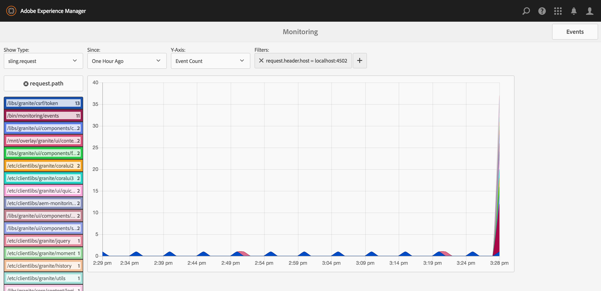

# AEM Monitoring
AEM Monitoring is an integrated software analytics solution for AEM.  It provides a simple interface for recording custom events, metrics, and counters, and a UI for analyzing data produced by your application.



## Use Cases
- Monitor external integrations (response time, error codes, etc.) to troubleshoot issues quickly
- Who deleted a component or deactivated a page? Track various AEM actions by user
- Track AEM page renders to find caching inefficiencies
- View system performance metrics, usage statistics, etc
- Easy integration with New Relic monitoring, with a single abstraction for both New Relic and local-only reporting
- Use in place of INFO logging to track any complex domain event

## Features
- High performance: capable of processing 100K complex events per hour
- Simple extension: Create your own events and properties properties, metrics, and counters with no pre-configuration
- Easily cluster publish instance to an author instance to see an entire environment's data from the author environment
- Store data for as long as you want, with configurable automatic deletion
  
## Setup
AEM Monitoring can be run in several possible configurations.  See [Supported Topologies](docs/topologies.md) for a comparison on each and setup instructions.  Also see [Configurations](docs/configuration.md) for a listing of the configuration options available in each topology.

## Usage

Although AEM Monitoring provides several types monitoring of out of the box, adding custom integrations is simple.  The primary service interface for recording metrics is [MonitoringService](core/src/main/java/com/icfolson/aem/monitoring/core/service/MonitoringService.java). Callers can leverage this service to record events, metrics, and counters:

```java
import com.icfolson.aem.monitoring.core.model.base.DefaultMonitoringEvent;
import com.icfolson.aem.monitoring.core.model.MonitoringEvent;
import com.icfolson.aem.monitoring.core.model.QualifiedName;
import com.icfolson.aem.monitoring.core.service.MonitoringService;

public abstract class MonitoredComponent {
    
    private static final QualifiedName SOME_VALUE = new QualifiedName("some", "value");
    private static final QualifiedName EVENT_NAME = new QualifiedName("event");
    private static final QualifiedName THING_DONE = new QualifiedName("thing", "done");
    
    @Reference
    private MonitoringService monitoringService;
    
    public void doThing(final float someValue, final String anotherValue) {
        monitoringService.recordMetric(SOME_VALUE, someValue);
        
        final MonitoringEvent event = new DefaultMonitoringEvent(EVENT_NAME);
        event.setProperty("foo", someValue);
        event.setProperty("bar", anotherValue);
        
        final long start = System.currentTimeMillis();
        final String returnValue = actuallyDoThing();
        final long end = System.currentTimeMillis();
        
        event.setProperty("duration", end - start);
        event.setProperty("return", returnValue);
        monitoringService.recordEvent(event);
        
        monitoringService.incrementCounter(THING_DONE);
    }
    
    protected abstract String actuallyDoThing();
    
}

```

## Extension Points
- No configuration required for adding new data categories -- just code and go
- Modify/filter/augment monitoring data via the MonitoringFilter service interface
- Send monitoring data to a custom endpoint via the MonitoringWriter service interface
- Add custom properties to each system of origin to simplify querying
- Database is available for custom queries: add reporting, alarms, etc.

## Limits
The included test bundle generates a consistent configurable load.  The default settings will generate:
- 60 seconds of consistent events
- at 100 events per seconds (6,000 events)
- each event 10 string properties and 2 numeric properties (72,000 property instances)

This test has been extended to as many as 100K events over an hour, with minimal CPU or memory load witnessed, although this rate does use roughly 50M of disk space during that hour.  For that reason, it is recommended that you design each event such that they will be fired less than 500K times per day, and that adequate disk space be considered during development/deployment.
Some other limits include:
- Names (for events, event properties, metrics, and counters) should be limited to 200 characters
- Values for event properties are either strings less that 4000 characters, or floating-point values
- Metric values are floating-point values
- Counter increments are 64-bit integers (but default to 1)
- System properties (constant values representing a system of origin) have the same limitations as event properties

## Monitoring Data Types
AEM Monitoring provides multiple means of capturing analytics info.  Each type has different storage and visualization options.  Events are a collection of key/value pairs, metrics are real values, and counters are integers.  All types are defined by a qualified name and a timestamp.
